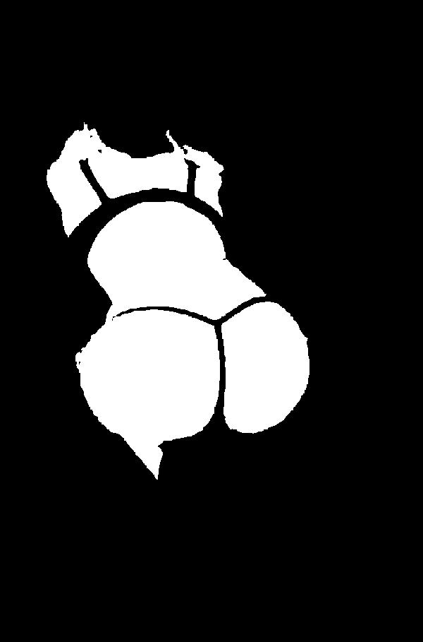

# nude.py

Automatic **nudity** detect in Python.

## Requirements

- Python 3.x
- Pillow
- argparse

## Usage

```shell
$ git clone https://github.com/seagullbird/nude.py.git
$ cd nude
$ pyvenv venv
$ source venv/bin/activate
$ pip install -r requirements.txt
$ python3 nude.py test_case/0.jpg test_case/1.jpeg
```

## Options

**-r**: Reduce image size to increase speed of scanning

**-v**: Generating areas of skin image

## Example

There are 2 examples in `test_case/` folder. Try any and enjoy.

**test_case/0.jpg:**

 

```shell
$ python3 nude.py -v test_case/0.jpg
```

Output:

```
True test_case/6.jpg None 706×1000: result=True message='Nude!!'
```

**test_case/0_Nude.jpg:**

 

## PS

This project is similar  but different to [hhatto/nude.py](https://github.com/hhatto/nude.py)

Similar in `resize()` and other out configuring and output methods but diffrent in main method  `parse()`. 

Feel free to fork.